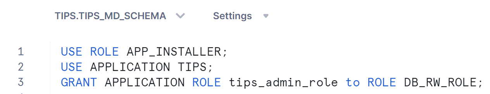
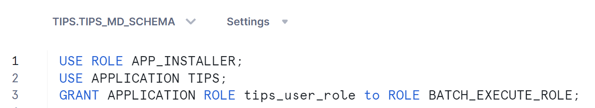

# Getting Started
Great, now that you have made your mind to give TiPS a try, let's get you started. We are confident that you will find it worth to give it a try. 

## Install TiPS App from Snowflake Marketplace
*if you have already installed the app, you can skip this section and head over to the [next section](#installation-overview)*

Sign-in to your snowflake account from Snowsight. Go Search for TiPS on <a href="https://app.snowflake.com/marketplace" target="_blank">Snowflake Marketplace</a>. From the search results, click on the icon for TiPS. This would open a new page with listing details about TiPS. Click on "Get" button. This should install TiPS on your snowflake account. Once the app is installed, you should receive a confirmation email about successful installation.

<span style="color:red">
<b><u>Please Note:</b></u>
</span>
When you install the app from Snowflake Market Place, <i>"Application Name"</i> is populated as as <b>"TiPS__Data_Transformation_Framework"</b> by default. It is advisable to change the <i>"Application Name"</i> to a shorter name E.g. "TiPS". App name is used in SQLs at quite a few places in the steps below, so having a shorted name would help.

Screenshot of how it appears by default:
   

Example screenshot with App Name changed to TiPS:
   

## Installation Overview
Once you have received confirmation email from Snowflake that TiPS has successfully been installed in your account, you should see it listed in "Apps" section on Snowsight. Navigate to "Data" section and click on Databases. Within the list of databases, you should also see TiPS (with the name that you provided when installing the app), just like any other database. On expanding the app, you would see 4 schemas (as below):
### INFORMATION_SCHEMA
This is the standard schema that snowflake creates inside every database.
### TIPS_MD_SCHEMA
This is the schema where all metadata objects used by TiPS reside. Details about these metadata tables are available in [Introduction Page](index.md#tips-metadata-tables) and [Reference Page](reference.md)
### DIMENSION
TiPS is installed with a sample data pipeline named TIPS_TEST_PIPELINE. This schema contains objects related to the sample data pipeline. This schema represents presentation layer where objects exposed to end user and downstream systems reside.
### TRANSFORM
TiPS is installed with a sample data pipeline named TIPS_TEST_PIPELINE. This schema contains objects related to the sample data pipeline. This schema represents transformation layer where objects that form part of transformation logic in data pipelines reside.

## Grant Application Role
TiPS App is installed with 2 application roles:

- TIPS_ADMIN_ROLE - This is the role, which can read/write all TiPS metadata objects. It acts like an application owner role. Assign this role to other account/database roles and/or users who need read/write privileges to TiPS metadata information <br>E.g., to grant this role to SYSADMIN:

```
USE ROLE <account role>;
USE APPLICATION <application name>;
GRANT APPLICATION ROLE tips_admin_role to ROLE <another account role>;
```

*`<account role>` -> Account role used while installing TiPS App*<br>*`<application name>` -> Application name used while installing TiPS App. By default (if not changed) it is TiPS*<br>*`<another account role>` -> This is the role which would have read/write/execution privileges to TiPS metadata tables and stored procedure*

An example snippet from Snowsight:


- TIPS_USER_ROLE - This role has least privileges. It can only read data from TiPS metadata tables and can execute data pipelines through TiPS stored procedure. Grant this application role to account/database roles and/or user who can only execute TiPS, without needing to have read/write privileges to any other underlying database objects. This role brings in additional security feature with TiPS [as described here](index.md#tips-security-aspect). <br>E.g., to grant this role to least privileged account role:

```
USE ROLE <account role>;
USE APPLICATION <application name>;
GRANT APPLICATION ROLE tips_user_role to ROLE <another account role>;
```

*`<account role>` -> Account role used while installing TiPS App*<br>*`<application name>` -> Application name used while installing TiPS App. By default (if not changed) it is TiPS*<br>*`<another account role>` -> This is the role which can only execute TiPS without needing any privileges to underlying tables of data pipelines*

An example snippet from Snowsight:
    

## Grant Execute Task Privilege to Application
TiPS can be executed as DAG of tasks through run_process_with_tasks stored procedure. This allows steps of a data pipeline to execute in parallel. This can help with reducing run times as independent steps can be executed simultaneously. TiPS utilised snowflake tasks to achieve this functionality. Hence for execution of data pipelines with run_process_with_tasks stored procedure, EXECUTE TASK privilege is needed. Run the following command to grant execute task privilege to TiPS
```
USE ROLE <account role>;
GRANT EXECUTE TASK ON ACCOUNT TO APPLICATION <application name>;
```
*`<application name>` -> Application name used while installed TiPS App. By default (if not changed) it is TiPS*

An example snippet from Snowsight:
    

Now that you have got application installed and grants sorted, you are ready to execute sample data pipeline and see TiPS in action.
## Executing Sample Data Pipeline (*Serial Mode*)
Run the following statements to execute TiPS in serial mode. *In serial mode, steps are run one after other using topological sorting based on parent_process_cmd_id and process_cmd_id*:

```
USE ROLE <account or database role>;
USE APPLICATION <application name>;
USE SCHEMA tips_md_schema;
call run_process('TIPS_TEST_PIPELINE','{"COBID":"20230410","MARKET_SEGMENT":"FURNITURE"}','Y', '<application name>');
```
*`<account or database role>` -> This is the role that either of the application role has been granted in [above step](#grant-application-role)*<br>*`<application name>` -> Application name used while installed TiPS App. By default (if not changed) it is TiPS*

An example snippet from Snowsight:
    

## Executing Sample Data Pipeline (*Parallel Mode*)
Run the following statements to execute TiPS in parallel mode. *In parallel mode, steps get executed in parallel as DAG of tasks depending on the settings of parent_process_cmd_id and process_cmd_id*:

```
USE ROLE <account or database role>;
USE APPLICATION <application name>;
USE SCHEMA tips_md_schema;
call run_process('TIPS_TEST_PIPELINE','{"COBID":"20230410","MARKET_SEGMENT":"FURNITURE"}','Y', '<application name>');
```
*`<account or database role>` -> This is the role that either of the application role has been granted in [above step](#grant-application-role)*<br>*`<application name>` -> Application name used while installed TiPS App. By default (if not changed) it is TiPS*

An example snippet from Snowsight:
    

## Checking execution logs
Once execution of sample data pipeline is completed, execution log in JSON format is shown as return value. Execution logs are also stored in `<application name>`.tips_md_schema.process_log table, which can be used to query execution logs for previous runs. 
Run the following statement to query execution log from `<application name>`.tips_md_schema.process_log table:

```
USE APPLICATION <application name>;
USE SCHEMA tips_md_schema;
SELECT * FROM process_log ORDER BY process_log_id DESC;
```
*`<application name>` -> Application name used while installed TiPS App. By default (if not changed) it is TiPS*

An example snippet from Snowsight:
    

There is also a view `<application name>`.tips_md_schema.vw_process_log available, which can be used to query the execution log in a tabular format. This view flattens out the JSON format log information into easily readable tabular format. This can be helpul in identifying individual SQLs ran within the pipeline and it also includes information like elapsed time to execute individual SQL statements along with number of rows affected. Run the following statement to query execution log from `<application name>`.tips_md_schema.vw_process_log view:

```
USE APPLICATION <application name>;
USE SCHEMA tips_md_schema;
SELECT * FROM vw_process_log WHERE process_log_id = <process log id> ORDER BY process_cmd_id, cmd_sequence;
```
*`<application name>` -> Application name used while installed TiPS App. By default (if not changed) it is TiPS*<br>*`<process log id>` -> Use process_log_id from process_log table. This filter is not mandatory, but good to have*

An example snippet from Snowsight:
    

## Setting up and executing your own Data Pipeline
If you have found using TiPS intresting so far and now want to use it in a more realistic way with your own dataset, please follow the steps below:

### Add metadata about your data pipeline
This step has to be done with the role that has been granted application role TIPS_ADMIN_ROLE, as you would be inserting records in PROCESS and PROCESS_CMD tables in `<application name>`.tips_md_schema schema.

- Add a record in PROCESS table - This table holds information about data pipeline. An example insert SQL would look something like:
```
INSERT INTO <application_name>.tips_md_schema.process (process_name, process_description)
VALUES ('MY_DATA_PIPELINE','This is a descrption about my data pipeline');
```
*- change column values as appropriate*<br>*- PROCESS_ID doesn't need to be included here. It would get auto populated.*

- Add record(s) into PROCESS_CMD table - This table holds information about individual steps within a data pipeline. An example insert sql would look something like:
```
SET process_id = (SELECT process_id FROM process WHERE process_name = 'MY_DATA_PIPELINE');

INSERT INTO process_cmd (process_id, process_cmd_id, parent_process_cmd_id, cmd_type, cmd_src,	cmd_tgt, refresh_type)	
VALUES ($process_id, 10, 'NONE', 'REFRESH',	'SCHEMA1.VIEW_1', 'SCHEMA1.TABLE_1', 'TI'),
VALUES ($process_id, 20, '10', 'APPEND', 'SCHEMA1.VIEW_2', 'SCHEMA2.TABLE_2', NULL),
VALUES ($process_id, 30, '10|20', 'PUBLISH_SCD2', 'SCHEMA1.VIEW_3', 'SCHEMA2.TABLE_3', NULL),;
``` 
*- change column values as appropriate*<br>*- add other columns and values as appropriate to the other command types supported. Details about all supported command types are available on [reference guide page](reference.md#command-types).*<br>*- PROCESS_CMD_ID is user defined. This dictates the order in which steps of pipeline are executed. Having wider gaps between process_id makes it easier in future to add steps in between without needing to reshuffle existing process_cmd_id.*<br>*- PARENT_PROCESS_CMD_ID is used to specify the process_cmd_id of preceding step. This is partifularly useful when running process in parallel mode. For steps where there are no preceding step, "NONE" should be used, and for steps where there are multiple preceding steps, then pipe delimited value can be entered as shown in above example*

### Grant appropriate privileges to Application
When the application is executed, it generates DML statements at run time for individual steps in a data pipeline and executes it. TiPS uses fully qualified object names for these DML operations. Database name is passed as one of the arguments when executing the application. Schema names and object names are part of metadata. To execute these generated DML statements, application needs to be granted privileges as appropriate for all underlying objects of a data pipeline.<br>E.g.
```
GRANT USAGE ON DATABASE <database name> TO APPLICATION <application name>;
GRANT USAGE ON SCHEMA <database name>.<schema name> TO APPLICATION <application name>;
GRANT SELECT ON VIEW <database name>.<schema name>.<view name> TO APPLICATION <application name>;
GRANT SELECT, INSERT, UPDATE, DELETE, TRUNCATE ON TABLE <database name>.<schema name>.<table name> TO APPLICATION <application name>;
```
*`<database name>` -> This is the database where objects of the data pipeline reside.*<br>*`<application name>` -> Application name used while installed TiPS App. By default (if not changed) it is TiPS*<br>*`<schema name>` -> Schema(s) in which objects of data pipeline reside.*<br>

### Execute Data Pipeline (*Serial Mode*)
You can execute data pipelines serially with TiPS using RUN_PROCESS stored procedure. In serial mode, steps of data pipeline run one after other and sequence of execution is derived using Topological sorting method.<br>E.g.
```
USE ROLE <account or database role>;
call <application name>.tips_md_schema.run_process('MY_DATA_PIPELINE','{"KEY1":"VALUE1","KEY2":"VALUE2"}','Y', '<database name>');
```
*`<account or database role>` -> This is the role that either of the application role has been granted (as described above)*<br>*`<application name>` -> Application name used while installed TiPS App. By default (if not changed) it is TiPS*<br>*`<database name>` -> This is the database where objects of the data pipeline reside.*

RUN_PROCESS stored procedure requires 4 argument values to be passed at execution:

1. PROCESS_NAME - This is the name of the pipeline, as specified in TIPS_MD_SCHEMA.PROCESS table in PROCESS_NAME column.
2. VARS - If bind variables have been used in pipeline definition, this is where you specify bind variables and their values to be used at the time of execution. It should be entered in JSON format string as shown above. If bind variables are not applicable, please use NULL for this argument.
3. EXECUTE_FLAG - This accepts 'Y' or 'N'. When 'N' is used, it implies that stored procedure is being called in non-execute mode (debug), where TiPS would generate all SQLs and output in execution log but would not execute the generated SQLs in database.
4. TARGET_DB_NAME - This is the database where objects of the data pipeline reside. At run time, TiPS would prepend this database name to source and targets defined in metadata (depending on command type). If NULL is used, TiPS would use the CURRENT DATABASE.

### Execute Data Pipeline (*Parallel Mode*)
You can execute data pipelines in parallel mode with TiPS using RUN_PROCESS_WITH_TASKS stored procedure. In paralle mode, steps of data pipeline can execute simultaneously as DAG of tasks. PARENT_PROCESS_CMD_ID is used to determine the position of execution of step within the DAG.<br>E.g.
```
USE ROLE <account or database role>;
call <application name>.tips_md_schema.run_process_with_tasks('MY_DATA_PIPELINE','{"KEY1":"VALUE1","KEY2":"VALUE2"}','Y', '<database name>', '<warehouse name>');
```
*`<account or database role>` -> This is the role that either of the application role has been granted (as described above)*<br>*`<application name>` -> Application name used while installed TiPS App. By default (if not changed) it is TiPS*<br>*`<database name>` -> This is the database where objects of the data pipeline reside.*

RUN_PROCESS_WITH_TASKS stored procedure requires 5 argument values to be passed at execution:

1. PROCESS_NAME - This is the name of the pipeline, as specified in TIPS_MD_SCHEMA.PROCESS table in PROCESS_NAME column.
2. VARS - If bind variables have been used in pipeline definition, this is where you specify bind variables and their values to be used at the time of execution. It should be entered in JSON format string as shown above. If bind variables are not applicable, please use NULL for this argument.
3. EXECUTE_FLAG - This accepts 'Y' or 'N'. When 'N' is used, it implies that stored procedure is being called in non-execute mode (debug), where TiPS would generate all SQLs and output in execution log but would not execute the generated SQLs in database.
4. TARGET_DB_NAME - This is the database where objects of the data pipeline reside. At run time, TiPS would prepend this database name to source and targets defined in metadata (depending on command type). If NULL is used, TiPS would use the CURRENT DATABASE.
5. WAREHOUSE_NAME - This is the name of warehouse that would be used as default warehouse to use if WAREHOUSE_SIZE column hasn't been specified at step level. For steps where WAREHOUSE_SIZE has been specified (in t-shirt sizes), string following the last underscore of this value is replaced with the one specified at step. E.g. value passed in this parameter is "TIPS_WH_XS", and at one of the steps WAREHOUSE_SIZE is "L", then for that step "TIPS_WH_L" warehouse would be used. This parameter cannot be NULL, but can accept CURRENT_WAREHOUSE() function instead.

All Done! You are now set to start using TiPS in its full swing. Please do checkout [TiPS Conventions](tips_conventions.md) and [Reference Guide](reference.md) for further useful information.

