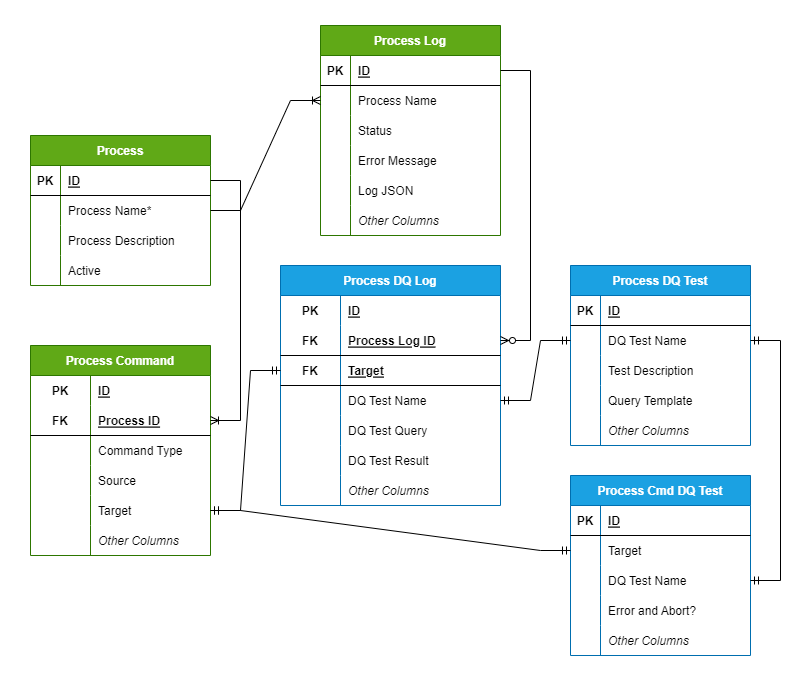

# Introduction to TiPS (Snowflake Native App)

### What is TiPS?
TiPS is a simple data transformation and data quality framework built for Snowflake.

With TiPS, building data pipelines becomes as easy as writing your transformation business logic in a database view acting as a data source, defining a target table where this transformed data would land, and adding a metadata record in the TiPS metadata table. That's it. You don't need to write or execute any DML statements for the movement of this data. TiPS dynamically generates and executes all relevant DML statements during runtime.

You can watch demonstration videos [here](demo_video_tips_v1.md).

Along with INSERT/APPEND/MERGE/DELETE/TRUNCATE, TiPS also offers pre-built command types such as:

1. PUBLISH_SCD2 - supports pushing data to SCD2 (slow changing type 2) dimension. For changed records, a new record is inserted, and the existing record is updated with applicable effective start and end dates.
2. COPY_INTO_FILE - supports extracting data from the Snowflake database to a file in a stage. The stage can be external, internal, or a named stage.
3. COPY_INTO_TABLE - supports loading data from a staged file into the Snowflake database table. The stage can be external, internal, or a named stage.

Details about all possible command types in TiPS are listed on the [reference guide page](reference.md#command-types).

The ideology behind TiPS was to create a framework that an experienced database professional, already adept with SQL, could easily use to deliver data pipelines with virtually zero learning curve.

A data pipeline in TiPS comprises multiple steps that can be chained together, with each step performing its own operation to move data from source to target or checking data quality. Steps within a data pipeline can perform one of two things:

* A movement of data from a source to a target. In most cases, the sources are database views encapsulating transformation logic in the desired form, while the targets are database tables.
* A data quality check to ensure that data being moved from source to target conforms to the desired form before being consumed by the data consumer, thus providing consistent results.

Here's an example data pipeline in TiPS:

TiPS was built with security in mind. The database credentials used to execute a pipeline do not require read/write access to the underlying data. In this regard, TiPS differs from other data transformation tools. We believe that data pipelines should be idempotent. Thus, if pipeline execution credentials were ever leaked, the worst-case scenario would be that a pipeline could be re-executed (compute costs would increase, but data integrity would not be compromised).

### What TiPS is not?
**TiPS is not a scheduler/orchestrator tool:**
TiPS doesn't have any scheduling or orchestration capabilities built-in. Orchestrating or scheduling the execution of data pipelines on a regular interval can be done through other tools like Airflow, Control-M, or Unix Cron.

**TiPS is not a Data Ingestion tool:**
TiPS is a transformation framework and is not intended to replace data ingestion tools like Fivetran or Matillion. With TiPS, the starting source of data for the data pipeline is usually data already landed into Snowflake tables from a source or from files stored in a Snowflake-accessible stage (external or internal, e.g., S3 on AWS).

### How does TiPS work?
TiPS is a simple-to-use metadata-driven transformation framework. All metadata is stored in database tables in Snowflake, which can easily be interrogated using normal SQL commands.

All TiPS objects are first-class database objects.

#### TiPS Security Aspect:
TiPS provides an extra security feature where the executing user of the stored procedure doesn't need to have direct read/write privileges on the underlying table/data. The user calling the stored procedure only needs privileges to execute the stored procedure.

### TiPS Metadata Tables:

* [PROCESS](reference.md#process) - Holds information about Data Pipelines, e.g., Name and Description of Data Pipeline.
* [PROCESS_CMD](reference.md#process_cmd) - This table holds information about individual steps within a data pipeline.
* [PROCESS_LOG](reference.md#process_log) - This table is populated with data pipeline execution logs when data pipelines are run through TiPS.
* [PROCESS_DQ_TEST](reference.md#process_dq_log) - This table comes with some preconfigured DQ tests. Users can configure new tests into this table.
* [PROCESS_CMD_TGT_DQ_TEST](reference.md#process_cmd_tgt_dq_test) - This table is configured to link DQ Tests to the Target (table).
* [PROCESS_DQ_LOG](reference.md#process_dq_log) - This table is populated with data quality test execution logs when data pipelines are run through TiPS. Data in this table is tied to the `PROCESS_LOG` table through the `process_log_id` column.

### Licensing
TiPS (Native App) is licensed under GNU (GPL), and you are free to install it from the Snowflake Marketplace and use it as you wish.
Any feedback and suggestions for improvements are always welcome. Kindly add your feedback/suggestions using [GitHub Discussions](https://github.com/orgs/ProjectiveGroupUK/discussions).

### Contact Us
If you feel the need to contact us, you can reach us through the channels below:

* [Projective Group Website](https://www.projectivegroup.com/)
* [Projective Group Sales Email](mailto://steve.jenkings@projectivegroup.com)
* [Projective Group Support Email](mailto://nitin.garg@projectivegroup.com)